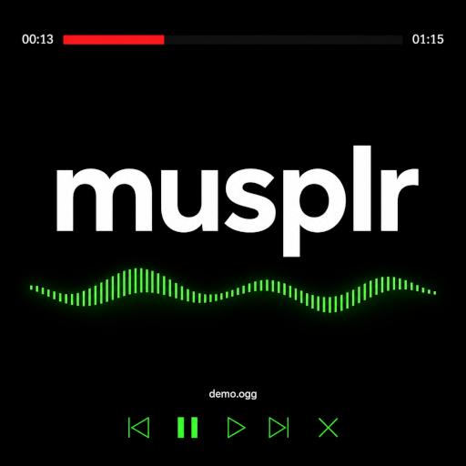

# musplr

This is a simple music player compatible with MP3 and OGG formats.

## How to Use

```plaintext
musplr [-m <music-file> | -d <music-dir>]

-m <music-file>   Path to a music file to play

-d <music-dir>    Path to a directory of music files to play

--help            Display this help message
```

## Known limitations:

- Audio files must be less than 50MB.
- File names must be less than 64 characters long.
- List of supported characters for file names: abcdefghijklmnopqrstuvwxyzABCDEFGHIJKLMNOPQRSTUVWXYZ0123456789&()'´’-_. ÁÀÃÂáàãâÉÊéêÍÎíîÓÔÕóôõÚÛúûÇç

This app was tested with a list containing 500 audio files and no problems were detected.

## Credits
- ps5-payload-sdk


<div align="center">


<br>
